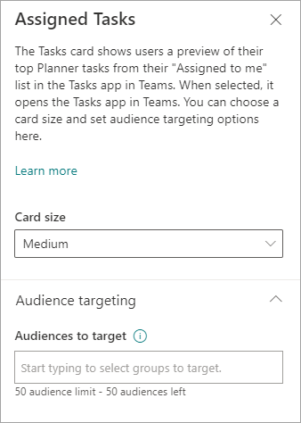
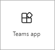
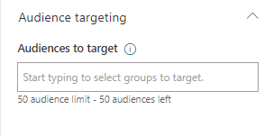
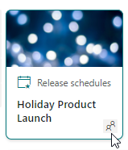

# Create a Viva Connections Dashboard (Preview)

>[!NOTE]
>The information in this article relates to a preview product that may be modified before it's generally available.
> 
The Viva Connections Dashboard provides fast and easy access to key employee data and job-related tasks targeted to users across roles, markets, and job functions. A Dashboard can be built with no code, or a developer can create custom cards to meet the specific needs of an organization.

   

Once certain prerequisites are met, the Dashboard is authored on your home site.  You can add it to Teams so that it's easily accessible to your users' mobile devices and desktops. And, you can add it to your home page using the Dashboard web part.

The Dashboard consists of cards that provide for user interaction such as existing Teams apps, third-party apps, custom solutions, and internal and external links. 

As you are building the Dashboard, you can see an approximation of how it will look on different devices. If you've audience targeted by any of the cards, use **preview** mode to see how it will look for different audiences. Then publish your Dashboard to make it available to users who have access to your home site.

>[!NOTE]
>Images are an important aspect to making your cards rich and inviting. If you're a SharePoint admin, we recommend enabling a Content Delivery Network (CDN) to improve performance for getting images. Consider when storing images that /siteassets is by default a CDN source when Private CDN is enabled while /style library is the default source when the Public CDN is enabled.  [Learn more about CDNs](/office365/enterprise/content-delivery-networks).  
>

This article includes:

- [Create a Dashboard and add cards to it](#create-a-dashboard-and-add-cards)
- [Add a Web link card](#add-a-web-link-card)
- [Add a Teams app card](#add-a-teams-app-card)
- [Audience targeting](#audience-targeting)
- [Preview your Dashboard to see how it will display for different audiences](#preview-your-dashboard-to-see-how-it-will-display-for-different-audiences)

## Create a Dashboard and add cards

A Dashboard can be created on any communication site, but we recommend you create it on your home site. You’ll need [edit permissions](/sharepoint/customize-sharepoint-site-permissions) on the site on which you're creating it.

1. On your home site, select **New > Dashboard**. The Dashboard page opens in Mobile view by default. 

>[!NOTE]
>You can choose Mobile, Tablet, and Desktop views interchangeably as you’re authoring.

2. Select **+ Add a card**.

 &nbsp;&nbsp;&nbsp;&nbsp;&nbsp;&nbsp;

3. Select the type of card you want to add from the Dashboard card toolbox and then follow the steps below to set up each type of card. As you’re building the Dashboard, you can preview its appearance in mobile, desktop, and tablet for different audiences.
Here are the built-in cards available now:

&nbsp;&nbsp;&nbsp;&nbsp;&nbsp;&nbsp;&nbsp;&nbsp; [Web link](#add-a-web-link-card): Add an internal or external link

&nbsp;&nbsp;&nbsp;&nbsp;&nbsp;&nbsp;&nbsp;&nbsp; [Assigned tasks](#add-the-assigned-tasks-card): Automatically display information to users about their assigned tasks.
 
&nbsp;&nbsp;&nbsp;&nbsp;&nbsp;&nbsp;&nbsp;&nbsp; [Teams app](#add-a-teams-app-card): Use an existing Teams app or bot

 
4. When you're done adding cards and targeting audiences, and you’re satisfied with how the Dashboard looks in preview, select **Publish** at the top-right of your Dashboard to make it available for use on your home site, in Teams, and in Teams mobile app. The view will default to Desktop view after you’ve published the Dashboard.

## Add a Web link card

Add a web link card when you want your users to go to an internal or external link on a web site. To do this task, perform the following steps:

1. While in **edit** mode, select **+ Add a card** from the Dashboard.
2. Select **Web link** from the web toolbox.

&nbsp;&nbsp;&nbsp;&nbsp;&nbsp;&nbsp;

3. In the property pane on the right side of the page, select your options.

&nbsp;&nbsp;&nbsp;&nbsp;&nbsp;&nbsp;

4. Select a size for the card from the **Card size** drop-down list.
5. Enter the URL for your link in the **Link** text box. 
6. Set the card-display options:
    1. Enter a title for the card in the **Card title** text box. (This title won't change your page title; it is the title that will be displayed on the top of the card.)

   2. Enter a description for the card in the **Card description** text box. This description will be displayed in larger text under the title.
3. Under **Thumbnail**, select one of the following options:
    - **Auto-selected**: This option when chosen automatically displays an image at the top of your card that comes from your page.
  - **Custom image**: This option when chosen enables the **Change** button.  You can select this button to choose an image you want to use.
4. Under **Card icon**, select one of the following options that enable the icon to be displayed on the left side of the card title:
    - **Auto-selected**: This option when chosen automatically displays a built-in icon associated with the page.
   - **Custom image**: This option when chosen enables the **Change** button.  You can select this button to choose an image you want to use.
    - **Icon**: This option when chosen enables the **Change** button.  You can select this button to choose from a set of stock icons.
5. If you want to target your card to specific audiences (that is, only the audience you specify will see the card in the dashboard), select one or more groups to target from the **Audiences to target**. For more information on audience targeting, see [Audience targeting](#audience-targeting).

## Add the Assigned tasks card

The Assigned tasks card enables automatic display of information to users about their assigned tasks. This information is retrieved from the Tasks app in Teams.

&nbsp;&nbsp;&nbsp;&nbsp;&nbsp;&nbsp;

1. While in edit mode, click **+ Add a card** from the dashboard.
2. Select **Assigned Tasks** from the Dashboard toolbox.

&nbsp;&nbsp;&nbsp;&nbsp;&nbsp;&nbsp;

3. In the property pane on the right, choose your card size from the **Card size** drop-down list.

&nbsp;&nbsp;&nbsp;&nbsp;&nbsp;&nbsp;

4. If you want to target your card to specific audiences (that is, only audience you specify will see the card in the dashboard), select one or more groups to target. For more information on audience targeting, see [Audience targeting](#audience-targeting).

## Add a Teams app card

A Teams app card allows you to create a card for an existing Teams app. To add a Teams app card:

1. While in **edit** mode, select **+ Add a card** from the Dashboard.
2. Select **Teams app** from the web toolbox.

&nbsp;&nbsp;&nbsp;&nbsp;&nbsp;&nbsp;

3. In the **property** pane on the right side of the page, select your options.

&nbsp;&nbsp;&nbsp;&nbsp;&nbsp;&nbsp;

4. Select a size for the card from the **Card size** drop-down list.
5.  Search for the Teams app you want to use, and then select it from the list.
6.  Set the card-display options:
    1. Enter a title for the card in the **Card title** text box. (This title won't change your page title; it is the title that will be displayed on the top of the card.)
    2. Enter a description for the card in the **Card description** text box. This description will be displayed in larger text under the title.
7. If you want to target your card to specific audiences (that is, only audience you specify will see the card in the dashboard), select one or more groups to target. For more information on audience targeting, see [Audience targeting](#audience-targeting).

## Audience targeting

By using audience targeting, you can promote cards to specific groups of people. This kind of targeting is useful when you want to present information that is especially relevant to a particular group of people. For example, you can target cards to a specific department.

### Set the target audiences for a card

1. If your page is not already in **edit** mode, click **Edit** at the top-right of the dashboard page.
2. Select the card you want to target to one or more audiences, and click the **Edit card** pencil from the toolbar on the left.
3. In the property pane on the right, under **Audiences to target**, type or search for the audience group(s) you want to target.

&nbsp;&nbsp;&nbsp;&nbsp;&nbsp;&nbsp;

>
>[!NOTE] If you've selected an audience group that you recently created or changed, it may take some time to see targeting applied for that group.
>

When a card is successfully audience targeted, you’ll see a **people** icon in the lower-left corner of the card.

&nbsp;&nbsp;&nbsp;&nbsp;&nbsp;&nbsp;

### Preview your dashboard to see how it will display for different audiences

When you've audience-targeted cards, you can see how different people will see your dashboard depending on the audience they are part of, and how the dashboard will look on mobile, desktop, and tablet.
What you see in **preview** mode approximates what it will look like on a device for audiences you choose (you can choose Desktop, Tablet, or Mobile). The actual view will depend on the device display of each user.

To preview for different audiences:

1. While in edit mode, select **Preview** on the top right.

&nbsp;&nbsp;&nbsp;&nbsp;&nbsp;&nbsp;

2. Open the **Select audiences to preview as** drop-down list. (if no cards are audience targeted, you will see a dimmed **Audience targeting** label).

3. Search for a group and select it. Once added, the group will be selected by default. You can select the group again in the **Select audiences to preview as** drop-down list to de-select it.

&nbsp;&nbsp;&nbsp;&nbsp;&nbsp;&nbsp;

- The cards that are targeted for the group you added will display.
- When one or more audiences are selected, cards that have no audience targeting will also display.
- If no audiences are selected, only cards that are not audience targeted will display. If no cards are audience targeted, none will display.
- If you are not part of one of the audiences you've selected, you will only see cards that are not audience targeted. If none are audience targeted, you won't see any cards.

You can also see how your Dashboard will look on Mobile, Table, and Desktop by selecting those options.

**Examples**

In the following example, the preview is set for Mobile, and the first one shows the top two cards are audience targeted as the part of the group that is selected for preview. In the second preview, the top two cards are not targeted for the chosen audience group.

&nbsp;&nbsp;&nbsp;&nbsp;&nbsp;&nbsp;
