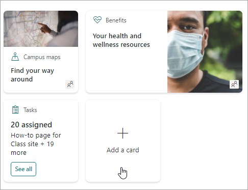
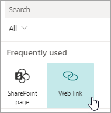
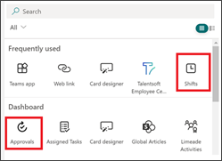

# Create a Viva Connections Dashboard

The Viva Connections Dashboard provides fast and easy-access to information and job-related tasks. Content on the Dashboard can be targeted to users in specific roles, markets, and job functions. The Dashboard consists of cards that engage viewers with existing Teams apps, third-party apps, custom solutions, internal, and external links. The Dashboard can be built with no code, or a developer can create custom cards to meet the specific needs of an organization. 

Once [certain requirements are met](guide-to-setting-up-viva-connections.md), the Dashboard can be created and edited from your [home site.](home-site-plan.md) As you are building the Dashboard, you can see a preview of how it will display for targeted audiences and different devices. Then publish your Dashboard to make it available to users who have access to your home site. When you are done, you can add it to Microsoft Teams so that it's easily accessible from a mobile device and desktop. You can also add it to your home page using the [Dashboard web part.](use-dashboard-web-part-on-home-site.md)

>[!NOTE]
>Images are an important aspect to making your cards rich and inviting. If you're a SharePoint admin, we recommend enabling a Content Delivery Network (CDN) to improve performance for getting images. Consider when storing images that /siteassets is by default a CDN source when Private CDN is enabled while /style library is the default source when the Public CDN is enabled. [Learn more about CDNs](/office365/enterprise/content-delivery-networks).  

**This article includes:**

- [Create a Dashboard and add cards](#create-a-dashboard-and-add-cards)
- [Add a Web link card](#add-a-web-link-card)
- [Add a Teams app card](#add-a-teams-app-card)
- [Add a Shifts card](#add-a-shifts-card)
- [Add a 3rd party card](#add-a-third-party-card-or-microsoft-app)
- [Apply audience targeting to cards](#apply-audience-targeting-to-cards)
- [Preview your Dashboard to see how it will display for different audiences and devices](#preview-your-dashboard-to-see-how-it-will-display-for-different-audiences)
- [Put the Dashboard on your home site using the Dashboard web part](#use-the-dashboard-web-part-for-viva-connections)

## Create a Dashboard and add cards

You’ll need [edit permissions](/sharepoint/customize-sharepoint-site-permissions) for the home site.

1. From the [home site,](home-site-plan.md) select the **Settings** gear at the top-right of the page.
2. Select **Set up Viva Connections**.
3. Select the **+ Create Dashboard** button.

   >[!NOTE]
   > - The Dashboard page opens in Mobile view by default.
   > - You can choose Mobile, Tablet, and Desktop views interchangeably as you’re authoring.
   > - Image recommendations for cards in the Dashboard: medium cards should be 300x150 to 400x200 with 2:1 aspect ratio and large cards 300x300 to 400x400 with 1:1 aspect ratio in order to prevent stretching in the mobile app.
   > - Image URLS in card properties must be an absolute URL in order for the link to work in the mobile app.

4. Select **+ Add a card**.

   

5. Select the type of card you want to add from the Dashboard card toolbox and then follow the steps below to set up each type of card. As you’re building the Dashboard, you can preview its appearance in mobile, desktop, and tablet for different audiences.
Here are the built-in cards available now:

   [Web link](#add-a-web-link-card): Add an internal or external link

   [Assigned tasks](#add-the-assigned-tasks-card): Automatically display information to users about their assigned tasks.
 
   [Teams app](#add-a-teams-app-card): Use an existing Teams app or bot

 
6. When you're done adding cards and targeting audiences, and you’re satisfied with how the Dashboard looks in preview, select **Publish** at the top-right of your Dashboard to make it available for use on your home site, in Teams, and in Teams mobile app. The view will default to Desktop view after you’ve published the Dashboard.

## Add a Web link card

Add a web link card when you want your users to go to an internal or external link on a web site. To do this task, perform the following steps:

1. While in **edit** mode, select **+ Add a card** from the Dashboard.
2. Select **Web link** from the web toolbox.

   

3. In the property pane on the right side of the page, select your options.

   

4. Select a size for the card from the **Card size** drop-down list.
5. Enter the URL for your link in the **Link** text box. 
6. Set the card-display options:
   - Enter a title for the card in the **Card title** text box. (This title won't change your page title; it is the title that will be displayed on the top of the card.)
   - Enter a description for the card in the **Card description** text box. This description will be displayed in larger text under the title.
3. Under **Thumbnail**, select one of the following options:
   - **Auto-selected**: This option when chosen automatically displays an image at the top of your card that comes from your page.
   - **Custom image**: This option when chosen enables the **Change** button.  You can select this button to choose an image you want to use.
4. Under **Card icon**, select one of the following options that enable the icon to be displayed on the left side of the card title:
   - **Auto-selected**: This option when chosen automatically displays a built-in icon associated with the page.
   - **Custom image**: This option when chosen enables the **Change** button.  You can select this button to choose an image you want to use.
    - **Icon**: This option when chosen enables the **Change** button.  You can select this button to choose from a set of stock icons.
5. If you want to target your card to specific audiences (that is, only the audience you specify will see the card in the dashboard), select one or more groups to target from the **Audiences to target**. For more information on audience targeting, see [Audience targeting](#apply-audience-targeting-to-cards).

## Add the Assigned tasks card

The Assigned tasks card enables automatic display of information to users about their assigned tasks. This information is retrieved from the Tasks app in Teams.

1. While in edit mode, click **+ Add a card** from the dashboard.
2. Select **Assigned Tasks** from the Dashboard toolbox.

   

3. In the property pane on the right, choose your card size from the **Card size** drop-down list.

   

4. If you want to target your card to specific audiences (that is, only audience you specify will see the card in the dashboard), select one or more groups to target. For more information on audience targeting, see [Audience targeting](#apply-audience-targeting-to-cards).

## Add a Teams app card

A Teams app card allows you to create a card for an existing Teams app. To add a Teams app card:

1. While in **edit** mode, select **+ Add a card** from the Dashboard.
2. Select **Teams app** from the web toolbox.

   

3. In the **property** pane on the right side of the page, select your options.

   

4. Select a size for the card from the **Card size** drop-down list.
5.  Search for the Teams app you want to use, and then select it from the list.
6.  Set the card-display options:
    - Enter a title for the card in the **Card title** text box. (This title won't change your page title; it is the title that will be displayed on the top of the card.)
    - Enter a description for the card in the **Card description** text box. This description will be displayed in larger text under the title.
7. If you want to target your card to specific audiences (that is, only audience you specify will see the card in the dashboard), select one or more groups to target. For more information on audience targeting, see [Audience targeting](#apply-audience-targeting-to-cards).

## Add a Shifts card

The Shifts card shows users information about their next or current shift from the Shifts app in Teams. They can also clock in and out and track break time when Time clock is enabled in Teams. 

>[!NOTE]
> The ability to use a Shifts card to clock-in and clock-out will become available in January 2022.

1. While in edit mode, select **+ Add a card** from the dashboard.
2. Select **Shifts** from the Dashboard toolbox.

3. In the property pane on the right, choose your card size from the **Card size** drop-down list.

4. If you want to target your card to specific audiences (that is, only audience you specify will see the card in the dashboard), select one or more groups to target. For more information on audience targeting, see [Audience targeting](#audience-targeting).

## Add a third party card or Microsoft app

The Viva Connections Dashboard and mobile experience can be extended and customized using cards, which are based on [adaptive cards](https://adaptivecards.io/) and the [SharePoint Framework (SPFx)](/sharepoint/dev/spfx/sharepoint-framework-overview). These adaptive cards are used to display data, complete tasks, and connect to Teams Apps, Websites, and mobile apps on Viva Connections. They provide a low-code solution to bring your line-of-business apps into the Dashboard. 

To create custom experiences on Viva Connections Dashboard and Viva Connections Mobile App, developers must use the SPFx to create custom ACEs. To learn more about creating ACEs, see the following tutorial: [Build your first SharePoint Adaptive Card Extension](/sharepoint/dev/spfx/viva/get-started/build-first-sharepoint-adaptive-card-extension). Learn more about [Viva Connections extensibility.](/sharepoint/dev/spfx/viva/overview-viva-connections)

### Add a 3rd party card
There are two ways to acquire third-party developers and partners solution package and add them on the Viva Connections dashboard.

#### Option 1: Acquire the app from a Microsoft AppSource or the SharePoint store
You can acquire apps from third- party developers by browsing the [Microsoft AppSource](https://appsource.microsoft.com/en-us/marketplace/apps?product=sharepoint) or [SharePoint store](https://techcommunity.microsoft.com/t5/microsoft-sharepoint-blog/explore-and-deploy-sharepoint-framework-solutions-from-partners/ba-p/2645289) (recommended).

- If you are building a dashboard, you can [request the app directly](https://techcommunity.microsoft.com/t5/microsoft-sharepoint-blog/explore-and-deploy-sharepoint-framework-solutions-from-partners/ba-p/2645289), but you will need approval from an admin of the tenant-level app catalog to continue with the installation
- If you are an **admin** of a tenant-level app catalog, you can deploy business apps directly.

[Get step-by-step guidance](https://techcommunity.microsoft.com/t5/microsoft-sharepoint-blog/explore-and-deploy-sharepoint-framework-solutions-from-partners/ba-p/2645289) on how to request and deploy an app, and add an app to your site. For tenant admin, [learn how to manage apps](/sharepoint/use-app-catalog#work-with-sharepoint-store-apps) in the App Catalog.

#### Option 2: Acquire the app directly from the third-party developer

 >[!NOTE]
 > SharePoint administrative permissions are required to complete this task.

You can request apps directly from the Viva Connections third-party developers and partners. Admin permissions are required to [add the app to tenant level app catalog.](use-app-catalog.md) 

### Add a Microsoft app as a card on the Dashboard

A Microsoft app card allows you to create a card that links to Microsoft apps e.g., Shifts, Approvals, Task. Microsoft apps cards will be available Out of the Box when Viva Connections is enabled.

1. While in edit mode, select **+ Add a card** from the Dashboard.

2. Select the Microsoft App you want to add from the web toolbox.

   

3. Select your options in the property pane on the right side of the page.

4. When you **Republish**, the card will appear on your dashboard.

## Apply audience targeting to cards
By using audience targeting, you can promote cards to specific groups of people. This kind of targeting is useful when you want to present information that is especially relevant to a particular group of people. For example, you can target cards to a specific department. [Learn more about audience targeting](https://support.microsoft.com/office/target-content-to-a-specific-audience-on-a-sharepoint-site-68113d1b-be99-4d4c-a61c-73b087f48a81)

### Set the target audiences for a card

1. If your page is not already in **edit** mode, select **Edit** at the top-right of the Dashboard page.
2. Select the card you want to target to one or more audiences, and select the **Edit card** pencil from the toolbar on the left.
3. In the property pane on the right, under **Audiences to target**, type or search for the audience group(s) you want to target.

    >[!NOTE] 
    > If you've selected an audience group that you recently created or changed, it may take some time to see targeting applied for that group.

4. When a card is successfully audience targeted, you’ll see a **people** icon in the lower-left corner of the card.

   

### Preview your dashboard to see how it will display for different audiences

What you see in *preview mode* approximates how the Dashboard will display for certain audiences and devices. When you apply audience targeting to cards, you can preview how different people will view the Dashboard depending on the audience or device - mobile, desktop, and tablet.
 
#### To preview different audiences:

   1. While in edit mode, select **Preview** on the top right.

      

   2. Open the **Select audiences to preview as** drop-down list. (if no cards are audience targeted, you will see a disabled **Audience targeting** label).

   3. Search for and select a groups. Once added, the group will be selected by default. You can select the group again in the **Select audiences to preview as** drop-down list to de-select it.

   

   - Cards that targeted to a specific group will display.
   - When one or more audiences are selected, cards that *do not* have audience targeting applied will also display.
   - If no audiences are targeted, only cards that *are not* audience targeted will display. If there aren't any cards with audience targeting applied, none will display.
   - If you are not part of one of the audiences you've selected, you will only see cards that are not audience targeted. If none are audience targeted, you won't see any cards.

   #### Examples:

   In the following example, the preview is set for Mobile.

   - The image on the left shows the view for a specific audience that includes two specific cards. 
   - In the second image on the right, the top two cards are not displayed when previewing a different audience group.

   
   

## Use the Dashboard web part for Viva Connections

>[!NOTE] 
> - After editing content on the Dashboard, it may take several minutes until the new content is available in the Dashboard web part.
> - For best results, we recommend placing the Dashboard web part in a right vertical section.

Once a Dashboard is authored and published, you can use the Dashboard web part to display it on your home site. You can add the web part to any section on your page.  

When added, it will automatically be populated with the cards from the existing Dashboard on your site. You'll be able to set the maximum number of cards you want to display. [Learn how to use the Dashboard web part](use-dashboard-web-part-on-home-site.md).

## More resources

[Step-by-step guide to setting up Viva Connections](guide-to-setting-up-viva-connections.md)
