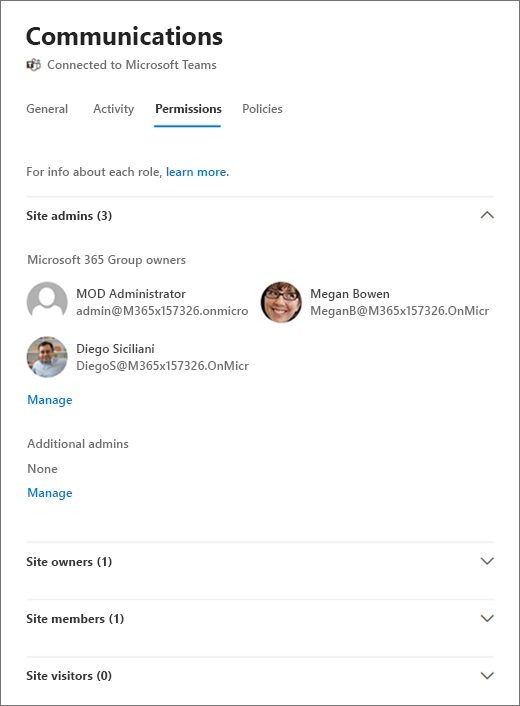

# Manage sites in the SharePoint admin center

The [Active sites page](https://admin.microsoft.com/sharepoint?page=siteManagement&modern=true) of the SharePoint admin center lets you view the SharePoint sites in your organization, including communication sites, channel sites, and sites that belong to Microsoft 365 groups. It also lets you [sort and filter sites](customize-admin-center-site-list.md), search for a site, and create new sites.
  

  
> [!NOTE]
> The Active sites page lists the root website for each site collection. Subsites and redirect sites (REDIRECTSITE#0) created by changing a site address or replacing the root site.  Some functionality is introduced gradually to organizations that have opted in to the [Targeted release option in Microsoft 365](/office365/admin/manage/release-options-in-office-365). This means that you might not yet see some features described in this article, or they might look different. 

For more info about tasks on the Active sites page, see:

- [Create a site](create-site-collection.md)
- [Register a site as a hub site](create-hub-site.md) and [Unregister a site as a hub site](remove-hub-site.md)
- [Change sharing settings for a site](change-external-sharing-site.md)  
- [Delete a site](delete-site-collection.md)
- [Manage site storage limits](manage-site-collection-storage-limits.md)

## Add or remove site admins and group owners

For all site types except channel sites, you can add or remove site admins and change the primary admin. For group-connected team sites, you can also add and remove group owners. Note that if you remove a person as a primary admin, they will still be listed as an additional admin. For info about each role, see [About site permissions](site-permissions.md).

1. In the left column, select a site. 
    
2. Select **Permissions**. 

3. Click **Manage** for the permissions that you want to update.

4. Add or remove people or change their role, and then click **Save**.
    
## Change a site's hub association

  
1. In the left column, select a site. 
    
2. Select **Hub**. The options that appear depend on whether the site you selected is registered as a hub site, or associated with a hub. The Hub menu lets you register a site as a hub site, associate it with a hub, change its hub association, and unregister it as a hub site. [More info about hubs](planning-hub-sites.md) 

## View site details

For more info about a site, select the site name to open the details panel or for channel sites select the link in the **Channel sites** column and then select the site name.
  

  
To view site activity including the number of files stored and storage usage, select the **Activity** tab. Activity information is not available for Office 365 Germany customers and US Government GCC High and DoD customers.
  
To view site admins, owners, members, and visitors, select the **Permissions** tab.

  
For info about the roles in this panel, see [About site permissions](site-permissions.md).

## Related topics

[Manage site storage limits](manage-site-collection-storage-limits.md)
