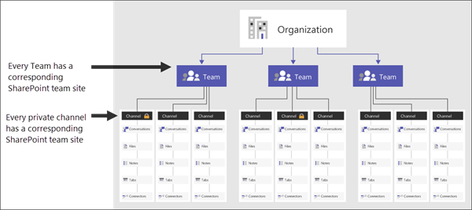
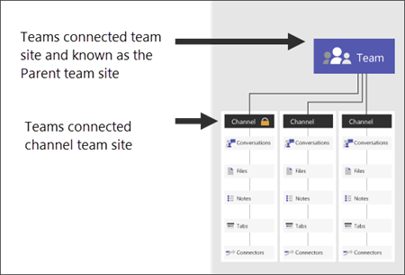
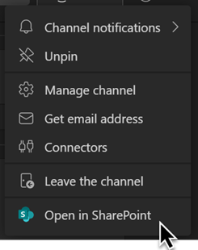
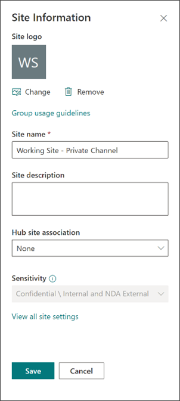

# Manage Teams connected sites
  
In this article, learn more about how to identify, manage, and navigate between teams in Microsoft Teams, SharePoint team sites and channel sites.

### What’s a Teams connected channel site?
When you create a team in Microsoft Teams, a Microsoft 365 connected team site in SharePoint gets automatically created. This site is referred to as a Teams connected team site. This team site contains folders for each standard channel created from Microsoft Teams. Also, when you create a private channel in Microsoft Teams, a team site in SharePoint also gets automatically created. 

These sites are referred to as Teams connected channel sites. The SharePoint sites that are Teams connected team sites and channel sites are a specialized site type of SharePoint team site that has been optimized for its Teams connection.

You’ll notice that a handful of typical SharePoint team site features aren’t available in Teams connected team sites and channel sites, such as:
- The ability to select the start symbol (follow links) on sites, lists, and libraries.
- 2013 Workflows
- The InfoPath form option is not available

## How to identify and navigate between Microsoft Teams and connected sites

Teams connected team sites and channel sites include additional information to indicate the connection to Microsoft Teams. In the SharePoint team site header, you will see the Microsoft Teams icon following the site logo and site title. 

For the parent team site, this link will always redirect to Microsoft Teams and the general channel for the Team. For the teams connected channel sites, this link will be a direct link to the channel in Microsoft Teams.

 

In the parent team site, the **Go to channel** link will be available in the command bar when viewing document libraries.

Additionally, from teams and channels in Microsoft Teams, you can select the ellipsis (…) at the top-right of the channel and then **Open in SharePoint** to navigate to the Teams connected team site or channel site in SharePoint.

## Manage Teams connected team and channel sites 

Teams connected team sites and channel sites are managed differently than the typical SharePoint team site. Certain site information and permissions can only be managed from the parent team site in Microsoft Teams settings. Learn more about how to [view and manage specific settings and permissions in Teams](https://support.microsoft.com/office/manage-team-settings-and-permissions-in-teams-ce053b04-1b8e-4796-baa8-90dc427b3acc#:~:text=If%20you%E2%80%99re%20a%20team%20owner%2C%20you%27re%20in%20control,or%20permissions%20you%20want%20to%20use.%20See%20More) connected channel sites.

### Manage membership and permissions
Common actions like editing site permissions directly within the SharePoint site are blocked for Teams connected channel sites. For Teams connected channel sites, all membership and permissions are managed through [Microsoft Teams settings](https://support.microsoft.com/office/manage-team-settings-and-permissions-in-teams-ce053b04-1b8e-4796-baa8-90dc427b3acc#:~:text=If%20you%E2%80%99re%20a%20team%20owner%2C%20you%27re%20in%20control,or%20permissions%20you%20want%20to%20use.%20See%20More). 
 

You’ll notice that when you navigate to **Settings**, there is no option to select **Site permission**. Private channel owners can add members or owners to the private channel through Microsoft Teams. 

**Learn more about managing membership in Teams:**

[Private channels in Microsoft Teams](private-channels)
 

[Manage team settings and permissions in Teams](https://support.microsoft.com/office/manage-team-settings-and-permissions-in-teams-ce053b04-1b8e-4796-baa8-90dc427b3acc)

### Manage site settings and classification

For Teams connected channel sites the sensitivity settings are inherited from the parent team site. When you view Site information for Teams connected channel sites in SharePoint, you will see Sensitivity labels, classification, and information barriers are read only. To manage or change these settings, the team owner can edit through [Microsoft Teams settings](https://support.microsoft.com/office/manage-team-settings-and-permissions-in-teams-ce053b04-1b8e-4796-baa8-90dc427b3acc#:~:text=If%20you%E2%80%99re%20a%20team%20owner%2C%20you%27re%20in%20control,or%20permissions%20you%20want%20to%20use.%20See%20More).

**Learn more about Microsoft Teams policies here:**

[Overview of security and compliance](security-compliance-overview)
 

[Manage teams policies in Microsoft Teams](teams-policies)

## More resources

[Create a Microsoft Team from SharePoint](https://support.microsoft.com/office/create-a-microsoft-team-from-sharepoint-545973b6-c38f-426a-b2b6-16405a561628)
 

[Microsoft Teams can have standard or private channels](https://support.microsoft.com/office/teams-can-have-standard-or-private-channels-de3e20b0-7494-439c-b7e5-75899ebe6a0e)

