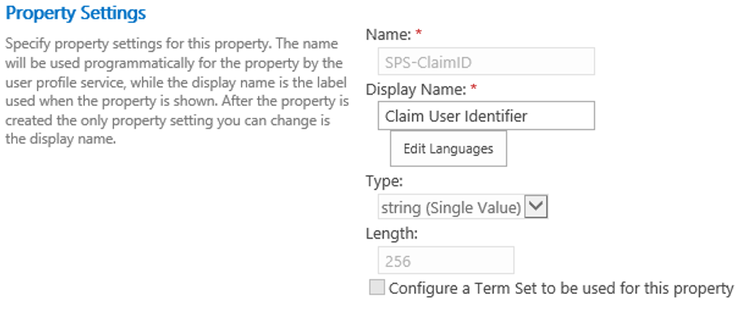
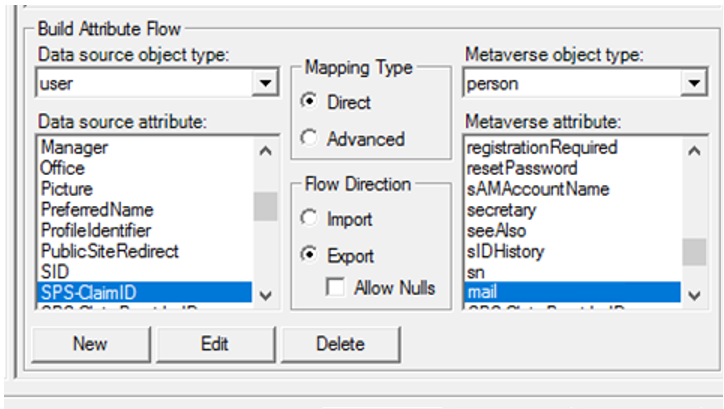
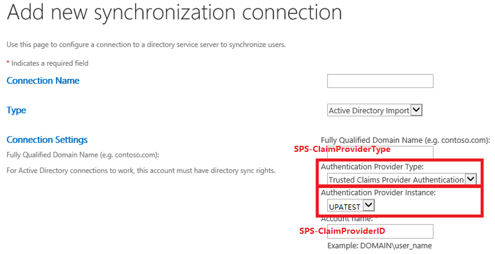

# Enhanced People Picker for trusted authentication method

In SharePoint 2019 and earlier, when trusted authentication is used, the People Picker control can’t search, resolve, and validate users and groups without writing a custom claim provider through C#.

Rather than writing a piece of C# code to implement a new claim provider, customers simply synchronize user profiles from their identity provider to the User Profile Application (UPA) service to make People Picker work.

In SharePoint Server Subscription Edition, People Picker is enhanced to search and pick user in UPA to help you avoid creating a customized claim provider. With the improved PowerShell cmdlet, you can easily reconfigure `SPTrustedIdentityTokenIssuer` and `UPABackedClaimProvider`.

Follow these configuration steps to make People Picker work:

1. Create a new token issuer using the [New-SPTrustedIdentityTokenIssuer](/powershell/module/sharepoint-server/new-sptrustedidentitytokenissuer) PowerShell cmdlet.
    ```
    $tokenissuer= New-SPTrustedIdentityTokenIssuer
        -ClaimsMappings <SPClaimMappingPipeBind[]> 
        -Description <String> 
        -IdentifierClaim <String> 
        -Name <String>
        -Realm <String> 
        -SignInUrl <String> 
        [-AssignmentCollection <SPAssignmentCollection>]
        -ImportTrustCertificate <X509Certificate2>
        [-UseWReply]
        [-Confirm] [-RegisteredIssuerName <String>]
        [-SignOutUrl <String>] 
        [-WhatIf] [<CommonParameters>]
        [-UseUPABackedClaimProvider]
    ```
    > [!Note]
    > Compared with TAP build 16.0.13115.1000, we removed the `-ServiceContext <SPServiceContextPipeBind>` parameter from this cmdlet and the `-UseUPABackedClaimProvider` parameter is optional.

    Following three parameters need special attention:<br/>

    1. **ClaimsMappings**<br/>
       `ClaimsMappings` specifies the mapping of claims from the original token to a SharePoint token. By using this parameter, SharePoint understands how to generate a SharePoint token when given a specific token from a user profile service application property.<br/>
       It accepts a list of `ClaimTypeMapping` objects, which are created by the [New-SPClaimTypeMapping](/powershell/module/sharepoint-server/new-spclaimtypemapping) cmdlet. A list of examples of `ClaimTypeMapping` objects given below. Provide these objects to the `ClaimsMappings` parameter:
        ```
        $emailClaimMap = New-SPClaimTypeMapping -IncomingClaimType "http://schemas.xmlsoap.org/ws/2005/05/identity/claims/emailaddress" -IncomingClaimTypeDisplayName "EmailAddress" -SameAsIncoming
        $upnClaimMap = New-SPClaimTypeMapping -IncomingClaimType "http://schemas.xmlsoap.org/ws/2005/05/identity/claims/upn" -IncomingClaimTypeDisplayName "UPN" -SameAsIncoming
        $roleClaimMap = New-SPClaimTypeMapping -IncomingClaimType "http://schemas.microsoft.com/ws/2008/06/identity/claims/role" -IncomingClaimTypeDisplayName "Role" -SameAsIncoming
        $sidClaimMap = New-SPClaimTypeMapping -IncomingClaimType "http://schemas.microsoft.com/ws/2008/06/identity/claims/groupsid" -IncomingClaimTypeDisplayName "SID" -SameAsIncoming
        ```

    2. **IdentifierClaim** <br/>
       The `IdentifierClaim` parameter specifies which claim type from the trusted STS will be used for the new identity provider. It can be set to the `InputClaimType` of the `ClaimTypeMapping` object created from the [New-SPClaimTypeMapping](/powershell/module/sharepoint-server/new-spclaimtypemapping) cmdlet.
        ```
        -IdentifierClaim $emailClaimMap.InputClaimType
        ```

    3. **UseUPABackedClaimProvider** <br/>
        This switch parameter enables the People Picker to search and select users and groups from the UPA service.
2. After `$tokenissuer` is created, customers can create a claim provider that uses the UPA service to search and resolve users and groups in the People Picker and specify that this claim provider will use the created token issuer.
    ```
    $claimprovider = New-SPClaimProvider 
        - AssemblyName "Microsoft.SharePoint, Version=16.0.0.0, Culture=neutral, publicKeyToken=71e9bce111e9429c" 
        - Description 
        - DisplayName
        - Type "Microsoft.SharePoint.Administration.Claims.SPTrustedBackedByUPAClaimProvider"
        - TrustedLoginProvider $tokenissuer
    ```
    Following three parameters need special attention:
    1. **AssemblyName**<br/>
       Specify this parameter as `Microsoft.SharePoint, Version=16.0.0.0, Culture=neutral, publicKeyToken=71e9bce111e9429c`
    2. **Type** <br/>
       Specify this parameter as `Microsoft.SharePoint.Administration.Claims.SPTrustedBackedByUPAClaimProvider` so this command knows that it needs to create a claim provider, which uses UPA as the claim source.
    3. **TrustedLoginProvider** <br/> 
       Specify this parameter as the token issuer that uses this claim provider. This is a new parameter that the user needs to provide when the type of the claim provider is `Microsoft.SharePoint.Administration.Claims.SPTrustedBackedByUPAClaimProvider`
3. The next step is to tell the `SPTrustedIdentityTokenIssuer`, which claim provider should be used for searching and resolving users and groups.
    ```
    Set-SPTrustedIdentityTokenIssuer <token issuer name> -ClaimProvider <claim provider object> 
    ```
    An example of this command is:
    ```
    Set-SPTrustedIdentityTokenIssuer "ADFS Provider" -ClaimProvider $claimprovider
    ```
4. Now, customers can start synchronizing profiles into the SharePoint User Profile Application service from the identity provider that are used in the organization. So that the newly created claim provider can work on the correct data set.<br/><br/>
There are two ways to synchronize user profiles into the SharePoint User Profile Application service. They are:
    - Use SharePoint Active Directory Import (AD Import) with **Trusted Claims Provider Authentication** as the **Authentication Provider Type** in the synchronization connection setting. To use AD Import, refer [Manage user profile synchronization in SharePoint Server](/sharepoint/administration/manage-profile-synchronization).
    - Use Microsoft Identity Manager (MIM). To use MIM, refer [Microsoft Identity Manager in SharePoint Servers 2016 and 2019](/sharepoint/administration/microsoft-identity-manager-in-sharepoint-server-2016).
        - There should be two agents inside the MIM synchronization Manager UX after MIM is set up. One agent is used to import user profiles from the source IDP to the MIM database. And another agent is used to export user profiles from the MIM database to the SharePoint User Profile Application service.

    During the synchronization, provide the following properties to the UPA service:

    1. **SPS-ClaimID** <br/>
       - Choose unique identity property in the source that will map to the **SPS-ClaimID** property in the User Profile Application service (preferred **Email** or **User Principal Name**).
       - Set the corresponding **IdentifierClaim** value while creating a token issuer from the [New-SPTrustedIdentityTokenIssuer](/powershell/module/sharepoint-server/new-sptrustedidentitytokenissuer) cmdlet.<br/>

       For AD Import synchronization, the **Central Administration -> Application Management -> Manage service applications -> User Profile Service Application -> Manage User Properties** UX will allow administrators to edit the **SPS-ClaimID** to indicate which property in the source identity provider should be synchronized to **SPS-ClaimID**. For example, if the **SPS-ClaimID** is email, set **Claim User Identifier** as **Email** in this UX.
       > [!Note]
       > The display name of **SPS-ClaimID** is **Claim User Identifier** in the UX and administrator can customize the display names.

        

        

        

       For MIM synchronization, map **Email** or **User Principal Name** to **SPS-ClaimID** in the MIM database to the SharePoint User Profile Application service agent:
        - In the MIM synchronization Service Manager, select the agent and open the **Configure Attribute Flow** UX. You can map **mail** to **SPS-ClaimID**.

        

    2. **SPS-ClaimProviderID** and **SPS-ClaimProviderType**<br/>
       - Set **SPS-ClaimProviderID** to the provider name as created in step #1 by the [New-SPTrustedIdentityTokenIssuer](/powershell/module/sharepoint-server/new-sptrustedidentitytokenissuer) cmdlet.<br/>
       - Set **SPS-ClaimProviderType** to **SPTrustedBackedByUPAClaimProvider**

       For AD Import synchronization, modify these 2 properties in the **User Profile Service Application -> Configure Synchronization Connections -> Create New Connection** UX while creating a new AD Import synchronization connection.
        - Set **SPS-ClaimProviderType** by setting **Authentication Provider Type** to **Trusted Claims Provider Authentication**
        - Set SPS-ClaimProviderID to the new token issuer name created by the [New-SPTrustedIdentityTokenIssuer](/powershell/module/sharepoint-server/new-sptrustedidentitytokenissuer) cmdlet.

        

       For MIM synchronization, set these 2 properties in the **Configure Attribute Flow** UX for the MIM database to SharePoint User Profile Application service agent:
        - Set **SPS-ClaimProviderType** to **Trusted** as Constant type
        - Set **SPS-ClaimProviderID** to the new token issuer name created [New-SPTrustedIdentityTokenIssuer](/powershell/module/sharepoint-server/new-sptrustedidentitytokenissuer) cmdlet.

        

5. Make groups searchable. <br/>
   To enable the People Picker control to work with groups, run the following steps:
    1. Group object must have a property named **SID** of type **groupsid** in the identity provider.<br/>
       You can create a `ClaimTypeMapping` object by using [New-SPClaimTypeMapping](/powershell/module/sharepoint-server/new-spclaimtypemapping) and then provide this object to [New-SPTrustedIdentityTokenIssuer](/powershell/module/sharepoint-server/new-sptrustedidentitytokenissuer) cmdlet with `-ClaimsMappings` parameter.

        ```
        $sidClaimMap = New-SPClaimTypeMapping -IncomingClaimType "http://schemas.microsoft.com/ws/2008/06/identity/claims/groupsid" -IncomingClaimTypeDisplayName "SID" -SameAsIncoming
        $tokenissuer = New-SPTrustedIdentityTokenIssuer -ClaimsMappings $sidClaimMap, $emailClaimMap …
        ```

       This sample cmdlets creates a `claimmap` object of type `groupsid` and indicates that it works with the **SID** property of the group. Then it creates a new identity issuer, which can understand this mapping.

    2. Synchronize **SID** property of groups from the identity provider to the **SID** property in UPA service.
        - For AD Import synchronization, SID will synchronize automatically from the source identity provider to the SharePoint User Profile Application service.
        - For MIM synchronization, take the property mapping from the identity provider to MIM and then from MIM to the SharePoint User Profile Application service so that MIM can synchronize the group **SID** from the identity provider to the SharePoint User Profile Application service. It’s like how we do user profile synchronization for the **SPS-ClaimID** property for user profiles.
        > [!Note]
        > For MIM synchronization, map **sAMAccountName** to **accountName** from MIM to the SharePoint User Profile Application service.
6. Change the default User Profile searchable properties so that users can choose which properties can be used to match keywords in the People Picker control.<br/>
Users can set which properties are searched by the People Picker by following this sample PowerShell script.
    1. Get the property list of the User Profile Application service, which is connected with a given web application.
        ```
        $site = $(Get-SPWebApplication $WebApplicationName).Sites[0]
        $context= Get-SPServiceContext $site
        $psm = [Microsoft.Office.Server.UserProfiles.ProfileSubTypeManager]::Get($context)
        $ps = $psm.GetProfileSubtype([Microsoft.Office.Server.UserProfiles.ProfileSubtypeManager]::GetDefaultProfileName([Microsoft.Office.Server.UserProfiles.ProfileType]::User))
        $properties = $ps.Properties
        ```

    2. Search for a list of given property names and set them as searchable. In this example, we set **First Name** and **Last Name** in the UPA service as searchable for the People Picker.
        ```
        $PropertyNames = 'FirstName', 'LastName'
        foreach ($p in $PropertyNames) {
            $property = $properties.GetPropertyByName($p)
            if ($property) {
                $property.CoreProperty.IsPeoplePickerSearchable = $true
                $property.CoreProperty.Commit()
                $property.Commit()
            }
        }
        ```
