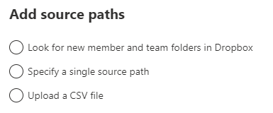

# Step 2: Scan and assess Dropbox

After you connect to Dropbox, the accounts are displayed automatically for you. Once the scans are complete, download the generated reports and logs to investigate any possible issues that might block your migration.

A table summary appears at the top to give you an at-a-glance overview of your users and content size.

1. Select **Scan**. Review the scanned root folders. Search for specific text, or select a filter to review the list more easily.
2. To include other sources, select **Add source path**. Choose to look for new sources, enter a specific source, or bulk upload many sources via a CSV file.

## Download reports

Summary and detailed scan reports are available to troubleshoot any issues.

1. Once the scan is complete, select **Download summary report**.

2. To download a detailed scan report for an individual account, select a single row, then select **Download scan log**.    

## Managing Users Who Own Large Amounts of Data 

Upon completing your scan, download the scan reports and review/address any large source data owners. 
 
The more users simultaneously being transferred, the higher our throughput for your migration. Users with large data sets should be broken into smaller Service Accounts to facilitate faster transfers. 
To maximize throughput, users should not own greater than 400,000 items or 5 TB of data. The more users you have, and the smaller the amounts of data they own, the faster your migration proceeds. 
Examples: 
 
If a user owns more than 400,000 items, this should be divided between four users so that each user owns 100,000 items. 
If a user owns more than 5 TB of data, this should be divided between 5 users so that each user owns 1 TB. 
 
To create Service Accounts, you can work with your Dropbox Admin to carry out the following: 
1. Once you have identified a large user,determine how many Service Accounts will be required (see example above). 
2. Create the Service Accounts in Dropbox and assign them a license. 
3. From the original large user, identify the folder(s) you would like to assign to the Service Account. 
4. Change the ownership of said folder(s) to the new Service Account. 
This may require that the original owner first share it with the new owner, where  the new owner would have to accept, then the original owner will then have the  option to select them as owner. 
5. When it comes to migrating the Service Account, create a corresponding OneDrive user/SharePoint site to migrate the new Service Account content to. 
6. Before making any changes, you should reach out to your tenant administrator, investigate any source custom solutions or ​integrations that you might be using, and determine if these ownership changes will have any impact.
 
When mapping please ensure that each Service Account has its own unique matching Destination account to optimize performance. 
 
|Source Path|Destination Path |
|:-----|:-----|
|originaluser@contoso.com | originaluser@contoso.com/[upload folder]* |
|serviceaccount1@contoso.com |serviceaccount1@contoso.com/[upload folder]* |
|serviceaccount2@contoso.com |serviceaccount2@contoso.com/[upload folder]* |
|serviceaccount3@contoso.com | serviceaccount3@contoso.com/[upload folder]* |

Asterix (*) = optional folder 

**NEXT:**  [ **Step 3: Copy to migrations**](mm-dropbox-step3-copy-to-migrations.md)

>[!NOTE]
>Migration Manager Google isn't available for users of Office 365 operated by 21Vianet in China. It's also not available for users of Microsoft 365 with the German cloud that use the data trustee *German Telekom*. It is supported for users in Germany whose data location isn't in the German datacenter.
>
> This feature is also not supported for users of the Government Cloud, including GCC, Consumer, GCC High, or DoD.