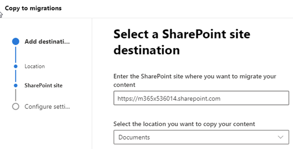
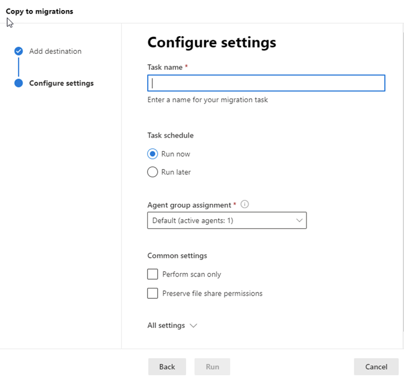

# Step 3: Copy to migrations

After a file share has been scanned and determined ready, add it to your migration list.  

1. Highlight one or rows from the scanned list. From the menu bar, select **Copy to migrations**.

2. Add a destination -- OneDrive, SharePoint or Teams. Select **Next**.

3.  Select a SharePoint site destination.  Enter the site path and the location within the site from the dropdown list. Select **Next**.

4. Under configure settings, enter a friendly name for your migration.
5. Select if you want to run the task now or later. If you select **Run later**, select a date and time.
6. Select an agent group and then review and edit your settings as needed.
7. Select **Schedule.**

>[!NOTE]
>Migration Manager for file shares isn't available for users of Office 365 operated by 21Vianet in China. It's also not available for users of Microsoft 365 with the German cloud that use the data trustee *German Telekom*. 
>
>It is supported for users in Germany whose data location isn't in the German datacenter.
>
> This feature is not supported for users of the Government Cloud, including GCC, Consumer, GCC High, or DoD.