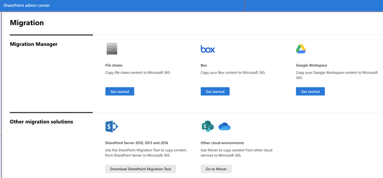

# Migrate Google Workspace to Microsoft 365 with Migration Manager

Collaborate all in one place by migrating your Google documents, data, and users to OneDrive, SharePoint, and Teams in Microsoft 365. 

## How does it work?

- **Step 1:** [Connect to Google](mm-google-step1-connect.md).   Sign in to your Google account and add the Microsoft 365 migration app to your Google Workspace account custom apps. 
- **Step 2:** [Scan and assess](mm-google-step2-scan-assess.md) Google Drive accounts are scanned automatically for you. Once the scans are complete, download the generated reports and logs to investigate any possible issues that might block your migration.
- **Step 3:** [Copy to Migrations list](mm-google-step3-copy-to-migrations.md) After a Google Drive has been scanned and determined ready, add them to your migration list.
- **Step 4:** [Review destination paths](mm-google-step4-review-destinations.md)  We automatically map source paths to any exactly matching destination paths. Ensure content is being copied to the right place by reviewing and modifying as needed for each destination path.
- **Step 5:** [Map identities](mm-google-step5-map-identities.md)   Map your groups and users in Google Drive to an account in Microsoft 365 to migrate your Google Drive permission settings.
- **Step 6:** [Migrate and Monitor](mm-google-step6-migrate-monitor.md) After reviewing your migration setup, migrate your Google accounts and monitor the progress

## Get started

To get started:

Go to the <a href="https://go.microsoft.com/fwlink/?linkid=2185075" target="_blank">Migration center</a> in the SharePoint admin center, and sign in with an account that has [admin permissions](/sharepoint/sharepoint-admin-role) for your organization.

Make sure that you have:

- **Access to the destination**: You must either be a global admin or OneDrive/SharePoint admin to the Microsoft 365 tenant where you want to migrate your content. 

- **Access to the source**: Have Google account credentials that have read access to any Google user account you plan to migrate.

- **Prerequisites installed:** Make sure you have the necessary prerequisites installed.

## Google Shared Drives

>[!Important]
>We are not able to read or write permissions to Google Shared Drives, therefore we cannot migrate permissions or membership of Google Shared Drives. 
>
>Google Shared Drives do not allow explicit folder-level permissions. Instead, Shared Drive permissions are based on the Shared Drive members.
>
>If you are migrating Google Shared Drives, follow the steps below.

**To migrate Google Shared Drives:**

1. Manually gather the membership list of the Google Shared Drive during your migration planning.
2. Create the destination document library in the appropriate team site of your SharePoint tenant. At this time, we recommend that you re-establish the membership list of the Google Shared Drive on the destination document library in your SharePoint tenant
3. Migrate the Google Shared Drive. If you didn't do it in step 2, re-establish the membership list of the Google Shared Drive in the destination document library in your SharePoint tenant.

## What isn't transferred

### What happens to Google Drawings, Forms, Sites, and Maps?

Google does not allow us to export Drawings, Forms, Sites, and Maps from Drive. These are not migrated.

### What about Docs, Slides, and Sheets?

Google's proprietary formats are not compatible with anything other than G Suite Drive. When migrating from G Suite, Migration Manager converts to the Microsoft Office format from Google's format.

|:-----|:-----|

>[!Note]
>The only way to migrate/download a Google format file is to request that they [Google] convert it. Microsoft does not control the conversion process, and the forced limitations are strictly on Google's end.

### Files marked as restricted

G Suite Drive enables owners to disable the ability for users to copy, download, or print a file on a per-file basis. This feature must be disabled on each file for which it has been enabled, in order for a migration to function properly, or you receive an error stating:

`Permissions issue: File marked as restricted or not copyable`

To disable this feature, see the **Sharing** settings for a file, and select **Advanced**. Check the checkbox for the owner of the file to **Disable options to download, print, and copy for commenters and viewers.**

    
### What happens to Google Drive shortcuts?

Shortcut files are not supported for migration. These shortcut files will not be transferred.

>[!NOTE]
>Migration Manager Google Workspace isn't available for users of Office 365 operated by 21Vianet in China.
>
> This feature is also not supported for users of the Government Cloud, including GCC, Consumer, GCC High, or DoD.

