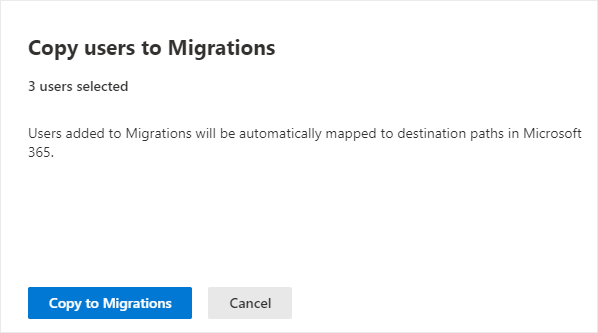

# Step 3: Copy to migrations

After a Google user has been scanned and determined ready, add them to your migration list.  

1. Select the **Migrations** tab. The table will list all users that have been copied to migration.

2. Select the users that are ready to be added to the migrations list.
3. Select **Copy to migrations**

 You can also select multiple users.

5. Select the **Migrations** tab, and proceed to the next step.

[**Step 4: Review destinations**](mm-google-step4-review-destinations.md)

>[!NOTE]
>Migration Manager Google isn't available for users of Office 365 operated by 21Vianet in China. It's also not available for users of Microsoft 365 with the German cloud that use the data trustee *German Telekom*. It is supported for users in Germany whose data location isn't in the German datacenter.
>
> This feature is also not supported for users of the Government Cloud, including GCC, Consumer, GCC High, or DoD.