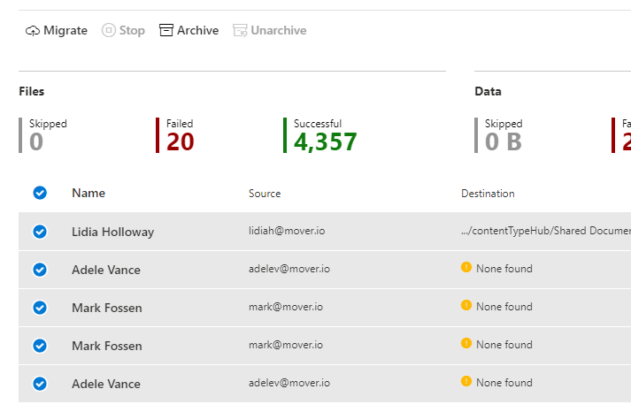

# Step 6:  Migrate and monitor your Google migration

Once have reviewed the drives, confirmed the destinations, correctly mapped identities, you are ready to migrate.

>[!Important]
>We strongly recommend that you do not rename or move migrated files before the final migration has been completed.  Doing so will result in files being overwritten.

1. Select the drives to migrate.

2. Select **Migrate**.

 

3. A confirmation step displays.  Click **Migrate**.  
4. Once the migration begins, monitor the migration status, and the table summary at the top. Depending on how large your migration, this step may take hours or days.

>[!Note]
> Starting your migration **does not** remove or delete anything from Google Workspace. Content from your Google drive is copied to your specified location in Microsoft 365. Make sure the destinations are correct, as once the migration starts, they cannot be modified.

## Estimated time to migrate

After tasks are scanned and copied to migrations, an "estimated time to migrate" is calculated.

The estimated time is based from the time a task starts running to when it is estimated that it will complete. When a task starts running, the status is **In progress**. The time a task is "queued" isn't added to the estimated time. 

:::image type="content" source="media/mm-google-estimated-time.png" alt-text="Estimated time for selected drives to migrate":::

>[!Important]
>If a user modifies the source folder, it must re-scanned and then re-copied to migrations. The estimated time will be recalculated based on this new scan.

For incremental tasks, the estimated time to migrate is harder to predict. It can either be faster or slower than than first run, depending on how many files the user has modified in the source. Be aware that the actual time of incremental runs may vary considerably from the estimate shown. 

Ongoing development will continue to improve the accuracy of these values.

## How many task rows can I run at once?

At a maximum, only 50 task rows (drives) can run simultaneously. This total includes both scanning and migrating.

If you select more than that total combined number and start scanning or migrating, only 50 randomly chosen rows will run. The rest will be queued.

As a task row completes, another from the queue will start migrating or scanning automatically.  While 50 task rows is the maximum allowed, if a migration experiences any slowdowns or back-off requests, it may drop lower than this number to keep the migration stable.

>[!NOTE]
>Migration Manager Google Workspace isn't available for users of Office 365 operated by 21Vianet in China.
>
> This feature is also not supported for users of the Government Cloud, including GCC, Consumer, GCC High, or DoD.
