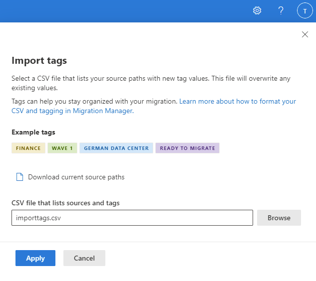

# Importing and using tags with Microsoft Manager

Use tags to better organize, plan, and schedule your content migrations in Migration Manager. Tags allow you to filter your tasks and more easily navigate through a large quantity of sources and users to find what you need. 

If you have a large migration project, you will likely migrate the content in phases or need to identify them by groupings. Applying tags to indicate department, region, wave, or any other collection relevant to your organization helps organize and manage your migration project. With tags, you can filter, group, and keep organized.
 
Tags can be updated anytime during your project. If you scan a group of sources and they are ready to migrate, you can apply new tags to identify their status quickly. Or if a group of tasks need to be run again, you may tag them with "Incremental run" to make that group stand out.

You can enter one or more tags per source, separating them with a semi-colon in the .csv file. Tags are case-sensitive, and filters on an exact string match. The tags are preserved even after you copy tasks to the migration tab. Summary reports and scans will also include tags.
 
>[!Note]
>Only the tag field can be updated using this .csv file. The ID, source name, and source path are included for reference only.

## Import and update tags

1. In the SharePoint admin center, select [Migration Manager](https://admin.microsoft.com/sharepoint?page=migrationCenter&modern). 
2. Select and connect to your migration source. Your sources are automatically scanned.
3. Highlight one or more tasks, and then select **Import tags** from the menu bar.

3. Select **Download current source paths**. The download .csv file will contain the Task ID, Source Name, Source Path, and Tags. If no tags were associated with the source, the value will be blank.

3. Enter the name of the tag associated with each source. If you want to apply more than one tag to a single source, separate the values using a semi-colon. Save the revised file.
4. Browse for the updated CSV file and then select **Apply**.

5. View the tags on the scan list and filter as needed.

