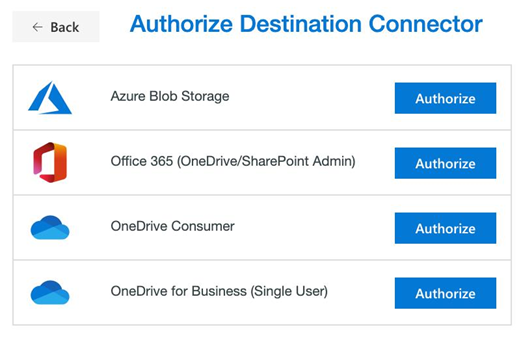

# Mover migration: Authorizing Office 365

## Authorize Office 365

>[!Warning]
>To fully authorize the **Office 365 Connector**, a global admin is required to grant permissions to the Office 365 Mover app within the Azure portal.
>
>The global admin must grant these permissions *after* the **Office 365 Connector** is authorized within the main Mover app.

The following instructions show you how to complete the authorization steps in the right order.

Some steps in the authorization process can be completed by a global or SharePoint admin in Office 365. At the beginning of each step, we indicate who can complete it.

1. **Global or SharePoint admin**: Log into the main Mover app via **app.mover.io**. In the **Transfer Wizard**, select **Authorize New Connector**.

    >[!Note]
    >Whether the **Office 365 Connector** is your source or destination connector (or both), you'll need to go through this authorization process.

    

2. **Global or SharePoint admin**: In the **Connector** list, find **Office 365**. Select **Authorize**.

    

3. **Global or SharePoint admin**: A window with an **Authorize** button appears. It prompts you to provide a display name \<optional\> for your **Office 365 Connector**.  Select **Authorize**.

    

4. **Global or SharePoint admin**: Follow the on-screen instructions. You are redirected to a Microsoft login screen where you can log in with your Microsoft admin privileges and continue to authorize the connector.

  
    >[!Warning]
    >If you are a **global admin**, a slightly different login screen appears.  
    >
    >If you select *Consent on behalf of your organization* during the authentication flow, you will grant admin access to your entire organization. **DO NOT do this**. 

     

To tighten your security beyond administrators, turn on **User assignment required** from the *Office 365 Mover* app settings in your Azure portal. You need to specifically assign your migrator users who may use the app.

5. **Global or SharePoint admin**: After authorizing the connector, you are redirected to the **Mover Transfer Wizard**, and an error appears, like the following. This means it is now time for a global admin in your tenant to grant permissions to the Office 365 Mover app in the Azure portal.

If you're a **SharePoint admin**: To grant permissions and finish the authorization process (Steps 6 – 9), point your global admin to **https://aka.ms/office365moverauth**.

If you're a **global admin**: Continue with Steps 6–9 to authorize the connector when you receive the message: *"Could not retrieve user count: A Global admin needs to authorize the Office 365 Mover application in the Azure tenant…"* 

   

6. **Global admin**: Log in to the Azure Portal via **https://aka.ms/office365moverauth**. A list of **Enterprise applications** appears.

    

7. **Global admin**: Find and select the Office 365 Mover app. A page appears that provides an overview of our app.

    

8. **Global admin**: In the left menu, find and open **Permissions**. Select **Grant admin consent for Mover**.

    

9. **Global admin**: A pop-up window appears that guides you through the rest of the permissions process. When complete, it closes automatically, and your **Office 365 Connector** is fully authorized and ready to go.

## Connect your destination Office 365 account

If you are not already connected after you have authorized your destination, select **Office 365**, and load the connector. An icon appears and show you how many users you are migrating.

