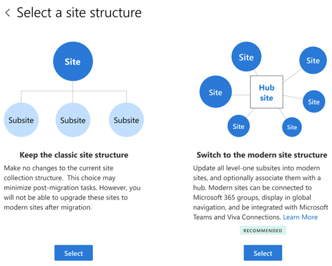
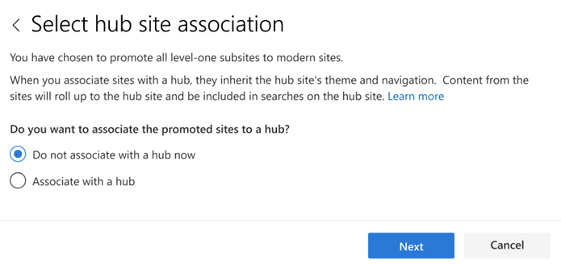

# Step 2: Create a migration task with SPMT

**Migrating data files from SharePoint Server document libraries**
  
1. Start SPMT, and then enter your Microsoft 365 username and password.
    
2. Select **Start your first migration**.
    
3. Select **SharePoint Server**.
    
4. Enter the SharePoint Server site URL where your content is located, and then select **Next**.
    
    > [!IMPORTANT]
    > Proxy connections are not supported. Using Proxy connections yields errors such as "SharePoint login fail" or "cannot load document library". 
  
5. Enter your username and password to the SharePoint Server site; username must use the format of someone@example.com. Select **Sign in**.
    
    > [!NOTE]
    > If you have already signed in to that site once while using this tool, you won't be prompted again for the same site. 

  
6. Select the document library where your files are located. The dropdown contains all your possible choices.
    
7. Enter the URL of the SharePoint site where you want your files migrated.
    
8. Select the document library to where your files will be copied.
9. Select either **Keep the classic site structure** (make no changes to the site structure) or **Switch to modern site structure** to modernize your site structure during migration.

    

10.	If you chose **Switch to modern site structure**, select if you want the promoted level-one subsites associated with a hub. 

   

11. If you chose to associate with a hub, select if you want to register your destination as a hub or associate the sites with an existing hub.

    

10.	Then you can review and edit destination URL for each subsite in Review hub and associated sites page

    
9. Select **Add**. This task is added to the list. If you want to select another set of data files to migrate, select **Add a source**.
    

**Next step:**  [**Step 3: Monitor and Report**]()
