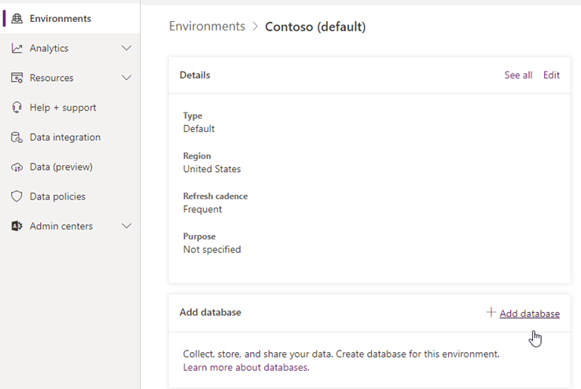

# Migrate SharePoint Server workflows to Microsoft 365

Microsoft removed SharePoint 2010 workflow services from existing tenants on November 1, 2020. We recommend that you move your classic SharePoint Server workflows to Power Automate flows. 

Using the SharePoint Migration Tool (SPMT), you can now migrate your SharePoint Server flows to Microsoft 365.
Workflow migration is limited to:

•	List and library OOB ("out-of-box") approval workflows
•	Workflow definitions and associations

History data and draft definitions are not migrated. 

## Prerequisites 

The following endpoints are required by workflow migration.

|Endpoint|Description|
|:-----|:-----|
|https://service.powerapps.com |
|https://api.bap.microsoft.com|
|https://gov.service.powerapps.us|
|https://gov.api.bap.microsoft.us|
|https://high.service.powerapps.us|
|https://high.api.bap.microsoft.us|
|https://service.apps.appsplatform.us|
|https://api.bap.appsplatform.us|

## Configure Power Automate 

If your tenant has never used Power Automate before, you must configure it before you begin migration. We recommend using Edge or Internet Explorer.

1.	Sign in to https://admin.powerplatform.microsoft.com/ using an admin account.
2.	Select **Add database** to your default environment.

3.	Wait for "State" status to change to **Ready**.
4.	To sync AAD user to CDS, sign in to **Microsoft Power Automate | Microsoft Power Platform** with the account you’d like to set as the default flow owner.

## Migrate workflows

1. Start SPMT, and then enter your Microsoft 365 username and password.    
2. Select **Start your first migration**.
3. Select **Workflow migration**.
4. Enter the URL of the SharePoint Server workflow you want to migrate and select which workflows to include in the migration. Select **Next**.
5. Enter your destination; the SharePoint site and list where you want to migrate your content.  If the site or the list doesn't currently exist, they will be created for you. Select **Next**. 
6. Review your migrations.  Select **Add another task** to select another set of files to migrate.

## Migrations report

The migration task generates workflow migration report as WorkflowMigrationReport.csv file under WF_xxx/Report/TaskReport_xxx/ folder. 

|Column name|Notes|
|:-----|:-----|
|Source association url|Source SharePoint object URL that associated with the workflow. Can be URL of list, library, site |
|Destination association url|Destination SharePoint object URL that associated with the migrated Power Automate flow. Can be URL of list, library.|
|Source workflow url||	
|Destination workflow url||	
|Source workflow ID||	
|Destination flow ID||
|Source workflow name||	
|Destination flow name||		
|Solution name|The name of Power Automate solution that contains migrated flows. Flow owner can find migrated flows in the solution.| 
|Source workflow owner|	The creator of source workflow instance|
|Destination flow owner|The owner(s) of migrated PA flow|
|Association type|Possible values: List, Site, or content type|
|Workflow version|Possible values: Workflow2010, Workflow2013|
|Workflow template name||	
|Status|Possible values: Migrated, Failed, or skipped|
|Result category|Possible values: Migrated, SCAN FILTER, SCAN FAILURE, FLOW CREATE FAILURE|
|Message|Error message|
|Error code||

## Activate migrated flows

After the migration has completed, the flow owner must sign in to Power Automate to turn on the migrated flows.

1.	Sign in Power Automate
2.	Navigate to **Solutions**, choose the latest one matching “Solution” in migration report.
3.	Edit connection references. Create new connection if there is no existing connection found. Pick an existing connection to a connection reference is recommended.
 
4.	Turn on flow after all connection references are configured.
 

After the migrated flows are turned on, testing is suggested to verify the behavior of the flows.

## The migrated flows

When SPMT migrates workflows to Power Automate, the transformation uses the modern Power Automate capabilities. An easy process lets you create the same or similar business requirements as in the original SharePoint workflows.

|Type|Options|
|:-----|:-----|
|List workflow|Manual start on selected item will have a new list flow with manual trigger, also known as *LIST_MANUAL_APPROVAL*. Trigger by new item and update item will have a new list flow with auto trigger, also known as *LIST_AUTO_APPROVAL*.|
|Document library|Manual start on selected file will have a new file flow with manual trigger, also known as *FILE_MANUAL_APPROVAL* Trigger by new file and update file will have a new file flow with auto trigger, also known as *FILE_AUTO_APPROVAL*.|
|Manual approval PA flow|Four user inputs are supported in the migrated flow. They are:  - Approval type Options: First to respond, Wait until all approve. - Approvers. Emails - Request. Text - CC. Emails - Enable Content Approval. On/Off|
| Auto triggered PA flow|The following configurations in workflow are migrated to destination flow.  - The approval type, **Everyone must approve** is used in the destination flow. - Approvers. Emails - Request. Text - CC. Emails - Enable Content Approval. On/Off|

 
